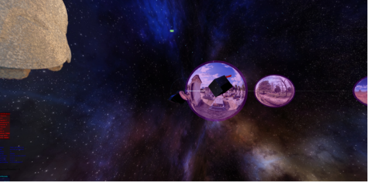

**How2  SphereWorld – a threeJS experiment** 

Code from 2014

Sphereworld is a project in which fun and function come together in a plastic way.

HTML + JavaScript + ThreeJS provide this flight through so-called spheres... spatial spheres that contain 360 degree images around Stuttgart (and Others). These spheres are placed in (world)space. The user (FPV) flies through this space on a spline.

As always, this code is also in github: <https://github.com/iCounterBOX/spehreWorld-TheeJs>

Both the spheres and the flying artifacts and banners can be modified as desired. A little JS knowledge is required ;-)

It's not a game! Pure relaxation while flying through space. No music or chatter. Works well on a projector.

The mouse "controls" the camera. The flight stays in the spline.

YT: <https://youtu.be/PfAjnZqhyD0>

<http://steinplus.com/sphere/>

